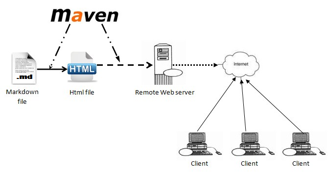
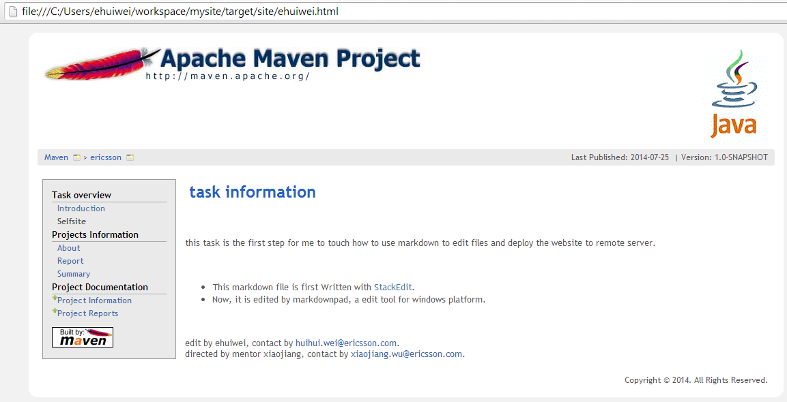

#Automatic deployment for bmc-maven-site#

###preparations###
####markdown####
- "Markdown" is two things: a plain text markup syntax,  and a software tool, written in Perl, that converts the plain text markup to HTML.
- Edit tool: [MarkdownPad 2]( http://www.markdownpad.com/) for windows OS, Another editor online [StackEdit](https://stackedit.io/).
- Markdown syntax learning: [markdown learning](http://zh.wikipedia.org/wiki/Markdown#.E7.BC.96.E8.BE.91.E5.99.A8).

####maven####
- environment: download the [Apache Maven 3.0.3](http://maven.apache.org/docs/3.0.3/release-notes.html), install it and config the environment variable correctly.
- maven learning: [Maven: The Complete Reference](http://books.sonatype.com/mvnref-book/reference/).

##Introduction##

This file introduces how to deploy the website generated by markdown edited files into the remote server automatically.

##Basic model description##

Use markdown editor to edit the contents you want to release, and translate these ".md" files into the format of "html", then deploy the generated site into the web server. Users can visit the right url for the content.

The model can be described as:

##Getting start for your first site##
In this section, you will build your first site use markdown and maven by the following steps.

####Step 1:fast generating of maven program skeleton####
    $ cd your/local/directory
    $ mvn archetype:generate

in the interface:

- Choose a number:(default for quick start type)
- Define value for groupId:com.abc.site
- Define value for artifactId：mysite
- Define value for version: (default version 1.0-SNAPSHOT)
- Define value for package: com.abc.site.mysite
- Confirm properties configuration:'Y' for confirm, and 'N' for change
The interface shows as:

Now, you will find the generated mysite directory files and category in it:

- program building file:pom.xml
- code frame:src\main\java\com\ericsson\ehuiwei\mysite\App.java 
- test frame:src\test\java\com\ericsson\ehuiwei\mysite\AppTest.java
 
###Step 2:edit markdown files###
The markdown files should be in ~/mysite/src/site/markdown, and images used in markdown files should be in ~/mysite/sre/site/resources

    $ cd ~/mysite/src
    $ mkdir site
    $ cd site
    $ mkdir markdown
    $ mkdir resources
    
Now, edit the markdown files in the markdown directory.
###Step 3:config the pom.xml###
To generate sites, config the pom.xml file first. 'maven-site-plugin' helps in generating the site, use plugin 'doxia-module-markdown' to transform the .md file into xml format.

    <bulid>
     ...
      <plugins>
        <plugin>
         <groupId>org.apache.maven.plugins</groupId>
          <artifactId>maven-site-plugin</artifactId>
          <version>3.0-beta-3</version>
           <dependencies>
            <dependency>
              <groupId>org.apache.maven.doxia</groupId>
              <artifactId>doxia-module-markdown</artifactId>
              <version>1.1.4</version>
            </dependency>
           </dependencies>
         </plugin>
       </plugins>
      ...
    </bulid>

In the same way, you can add plugins for program reports, for example, maven-javadoc-plugin for generating JavaDocs document, cobertura-maven-plugin for the reports of testing coverage, and maven-checkstyle-plugin for Java developers to defined specific coding standard, etc. Maven plugins can refer to [maven plugins](http://maven.apache.org/plugins/index.html)
###Step 4:site generation###
    $mvn clean site
Go to ~mysite/target/site, you will see dependencies.html、index.html、<myfilename\>.html etc. Open the <myfilename\>.html, you can see your edited content. Your first site has been successfully born.

Also, you can use

     $ mvn site:stage -DstagingDirectory=<another path>
in this way, your site will be generated in <another path\>.

###Step 5:define the site overview###
Site generated by maven is very flexible, users can also define the outlook and layers themselves. To define the outlook for a site, open src/site, new a file "site.xml" used for description of the site.
 
- project name:change the title of your site, default name will be the original project name.
- bannerLeft/bannerRight:add image shown in the left/right top of the site.
- version:site version.
- publishDate:site release time.
- skin:config the site skin.
- menu:self-define the menu in the left of the navigation.
- item:subitem below the menu.

An example is as the following:

    <?xml version="1.0" encoding="UTF-8"?>
    <project name="A test demo from ehuiwei" xmlns="http://maven.apache.org/DECORATION/1.0.0" 
    xmlns:xsi="http://www.w3.org/2001/XMLSchema-instance"
    xsi:schemaLocation="http://maven.apache.org/DECORATION/1.0.0 
    http://maven.apache.org/xsd/decoration-1.0.0.xsd">
  
    <version position="right"/>
    <publishDate position="right"/>
  
    <bannerLeft>
     <name>maven</name>
      <src>http://maven.apache.org/images/apache-maven-project.jpg</src>
       <href>http://maven.apache.org</href>
    </bannerLeft>
    <bannerRight>
     <name>java</name>
      <src>images/java.gif</src>
     <href>http://www.java.com</href>
    </bannerRight>
    <body>
     <breadcrumbs>
      <item name="Maven" href="http://maven.apache.org" />
	  <item name="ericsson" href="http://internal.ericsson.com" />
     </breadcrumbs>
     <menu name="Task overview">
      <item name="Introduction" href="index.html" />
      <item name="Selfsite" href="ehuiwei.html" />
     </menu>
     <menu name="Projects Information">
      <item name="About" href="project-info.html" />
      <item name="Report" href="project-reports.html"/>  
      <item name="Summary" href="project-summary.html"/> 	  
     </menu>
     <menu ref="reports"/>
      </body>
       <skin>
        <groupId>com.googlecode.fluido-skin</groupId>
	     <artifactId>fluido-skin</artifactId>
	      <version>1.3</version>
       </skin>
    </project> 
Again, generate your site:
    
    $ mvn clean site
Open ~/mysite/target/site, a new different outlook will be shown.

It looks really cool, doesn't it?

###Step 5:site deployment###
Deploy the site in your local directory, config pom.xml first, here is an example deployed in the way of file.
    <bulid>
    ...
     <distributionManagement>
      <site>
       <id>test_website</id>
       <name>test_website</name>
       <url>file:c:<file path></url>
      </site>
     </distributionManagement>
    ...
    </bulid>

Now, open c:<file path\>, you will find your generated site. Also, you can deploy it into a virtual hard disk address by changing the <url\> address
   
    <url>file:\\vhub....</url>

Then, open the browser, input the website corresponding to this address, you will see your site has been deployed to the web server. Also, to deploy your site into the remote server, you can refer [References](http://yidao620c.iteye.com/blog/1846992) and choose ftp,scp, sftp and dav(if remote server can be supported). 
###Step 6:update your site automatically###
If you want to see the newest version of your site no matter when you altered the markdown files. Thanks for maven-site-plugin, this job can be easily realized.

    $ mvn site:run
Open the browser, input "http://localhost:8080(default port)", you will see your site has been successfully generated. Also, by configing the port, for example, change the port to 9000, add port config information in pom.xml.

        <plugin>
         <groupId>org.apache.maven.plugins</groupId>
          <artifactId>maven-site-plugin</artifactId>
           <version>3.0-beta-3</version>
		    <configuration>
             <port>9000</port>
            </configuration>
        </plugin>
This time, open the browser, input "http://localhost:9000", it shows:

Now, change your markdown file and save, refresh the above address, what you find? Yes, you see the content you just altered.
###Step 7:automatic deployment in CI#
    $ cd <my dir>
    $ git clone ssh://@gerrit.sh.cn.ao.ericsson.se:29418/EMBMS/bmc-backend

Add your job into the project, and push it into the remote repository.

    $ git add..
    $ git commit..
    $ git push..
In jenkins, create a project for maven-doc and make cofiguration as the following:

- Source code management: 
 - > 1.git/Repository URL:ssh://@gerrit...git 
 - > 2.Branches to build:master
- Build a trigger: 
 - >1.Build periodically: 0 21 * * *(build on 21:00 every day)
 - >2.Poll SCM:*/5 * * * *(do scanning every 5 minutes, if any new version is found, start a new build)
- Build: 
 - >Execute shell/command: 

	        #!/bin/bash
	        ls -al
	        source /project/MBP/EMBM/env/env15a.sh
		    source /proj/MBP/EMBM/bmc/bin/activate
		 
		    mvn --version
			hostname
			java -version
			cd 3pp
			mvn clean install
			cd ../bmc
			mvn clean install
			mvn clean site
			
			ls -l /project/ecds/ccenv/www/htdocs/repo/doc/maven_site/BMC/15b
- operation after construction: 
 - >Files to deploy:**/*
 - >Basedir:${WORKSPACE}/bmc/target/site/
 - >Remote directory:/project/ecds/ccenv/www/htdocs/repo/doc/maven_site/BMC/15b/

Then build the project, till now, the whole job is finished. 
----
*edit information:  editor:Huihui Wei  Instructor:Xiaojiang Wu  2014-07-28*

 

